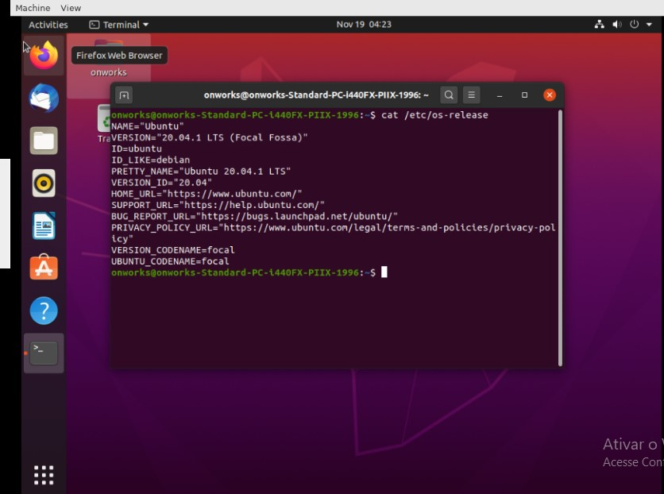

<h4 align="center"> 
  ♻️ Concluído 🚀
</h4>

## ❓ Enunciado
---

Utilizando o “OnWorks” inicie um sistema operacional Linux Ubuntu.

Procure e inicie o aplicativo do terminal.

Exiba a versão do Linux utilizando o comando correto.

Envie a imagem do comando e a resposta que exiba a versão do Linux.

## 📝 Resposta
---

