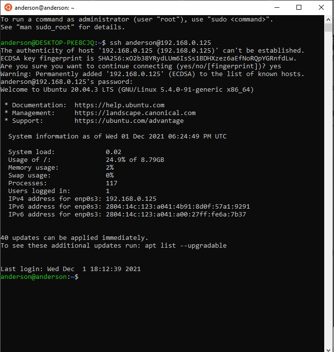
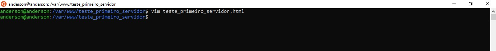
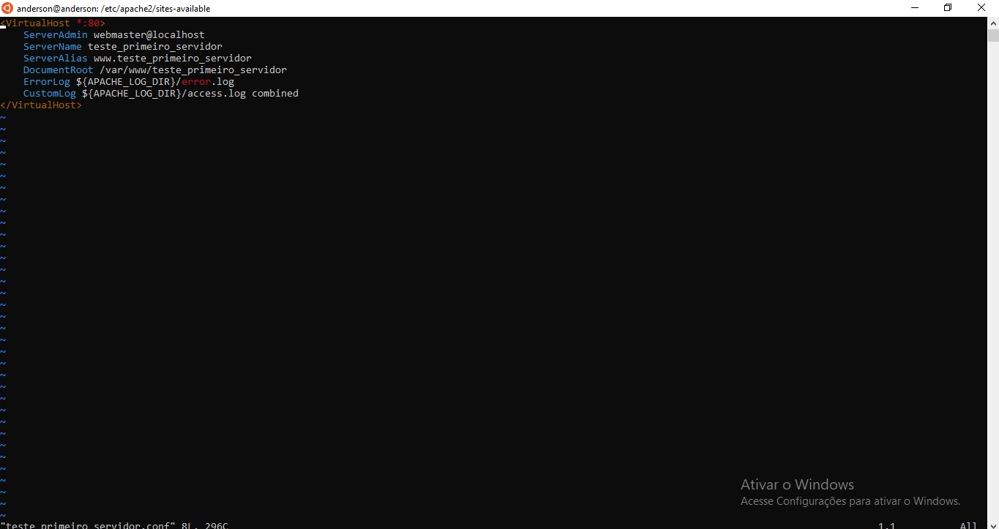
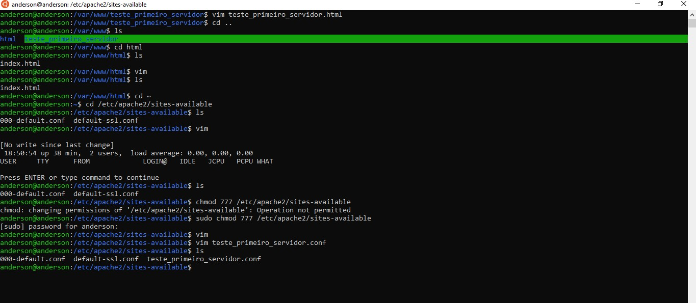
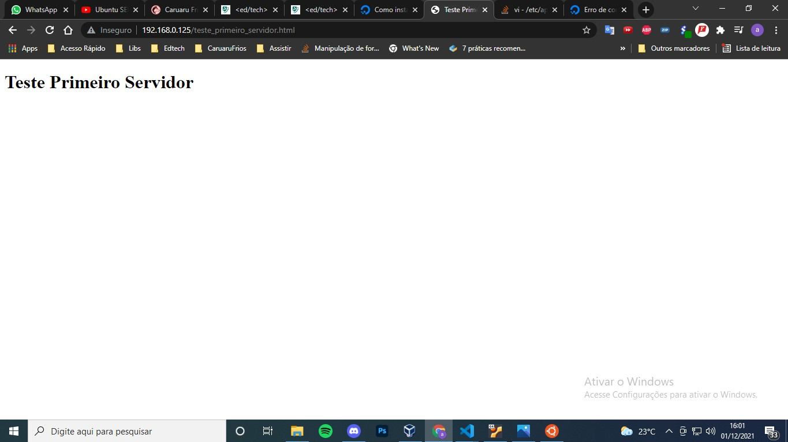
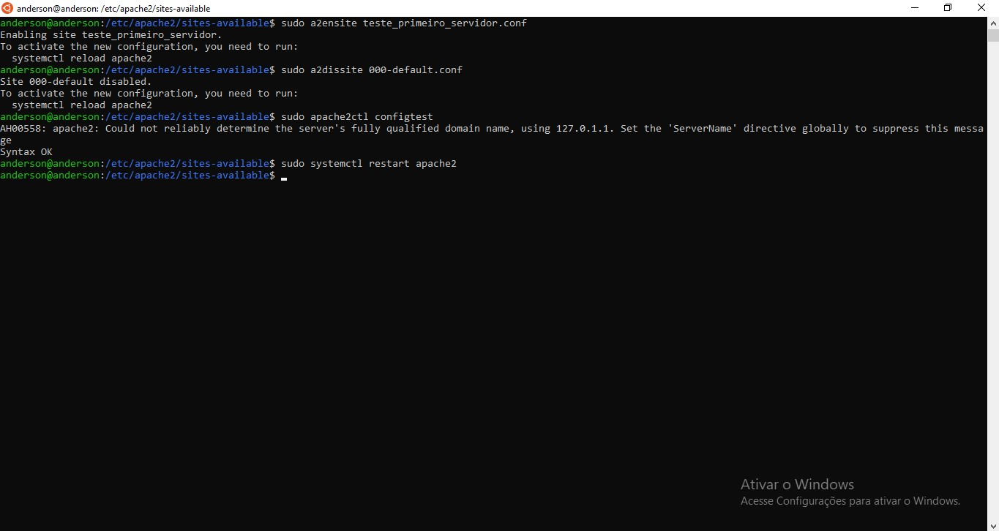
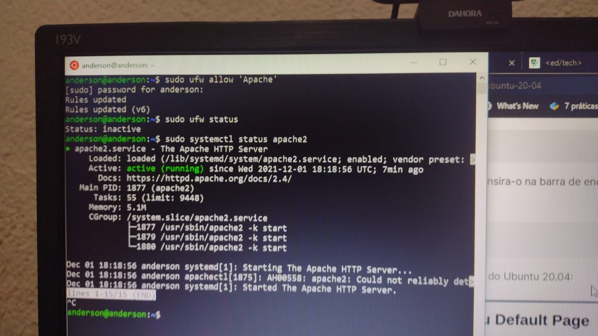
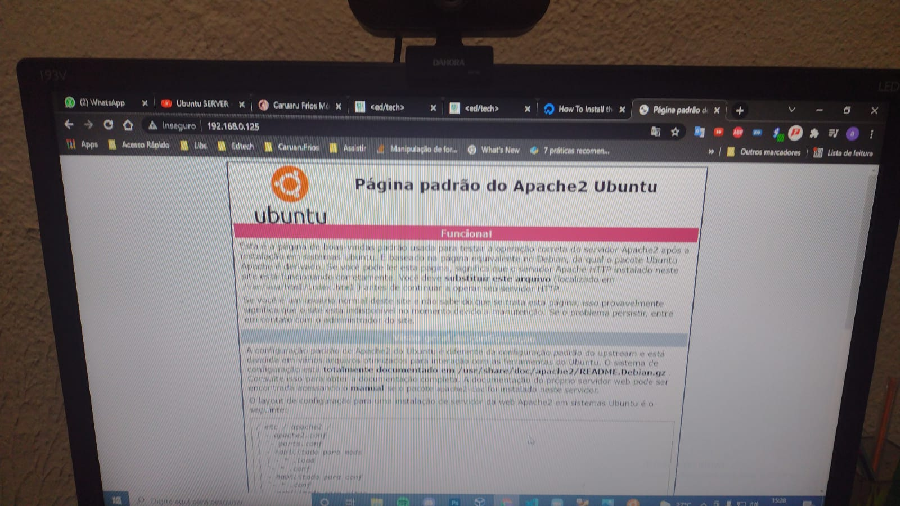
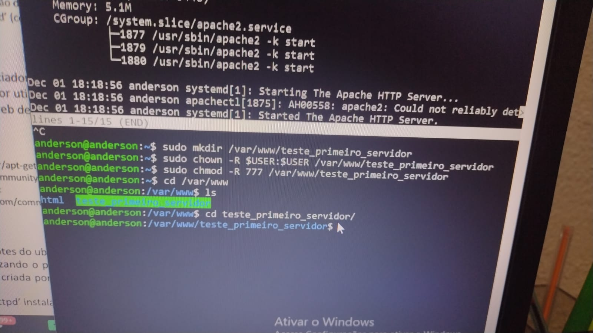
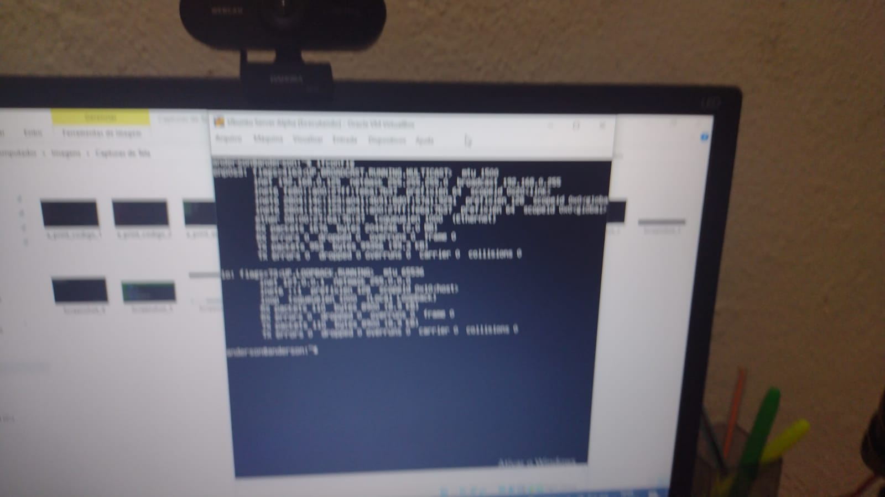

<h4 align="center"> 
  ♻️ Concluído 🚀
</h4>

## ❓ Enunciado
---
Instale o servidor ‘httpd’ utilizando o pacote e teste-o para ver se está funcionando. 
O teste deverá ser uma página criada por você e aberta no navegador com o endereço e porta definida.

## 📝 Resolução
---

