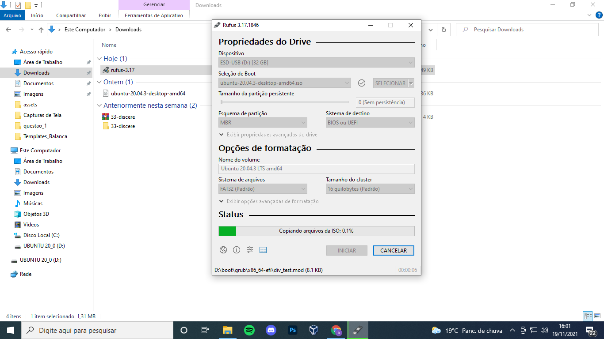
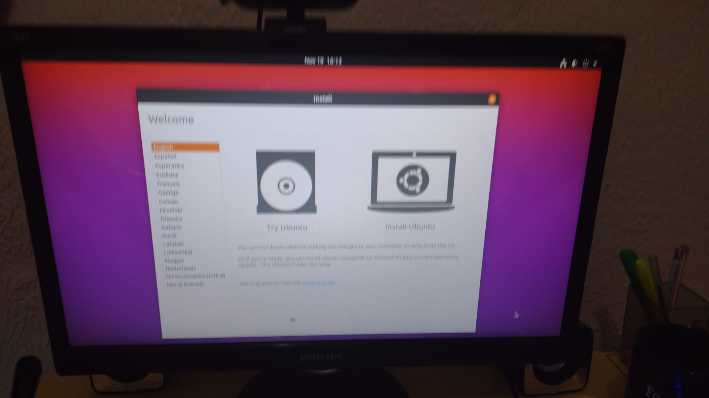
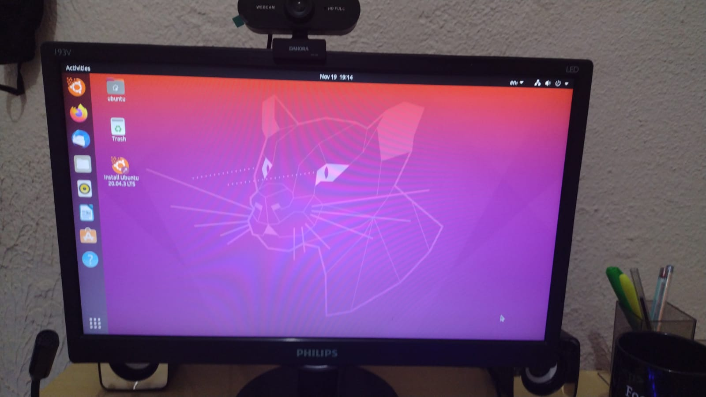
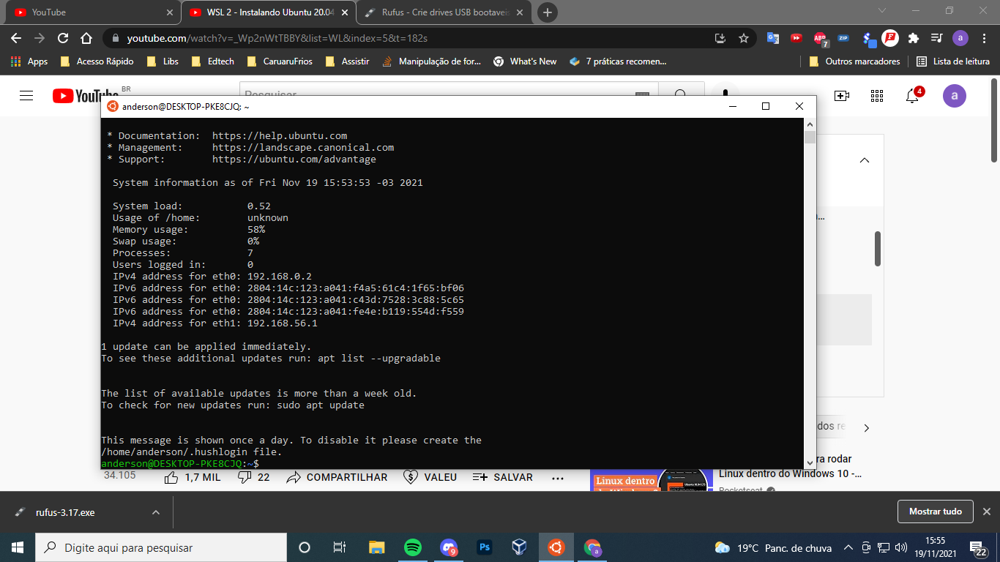
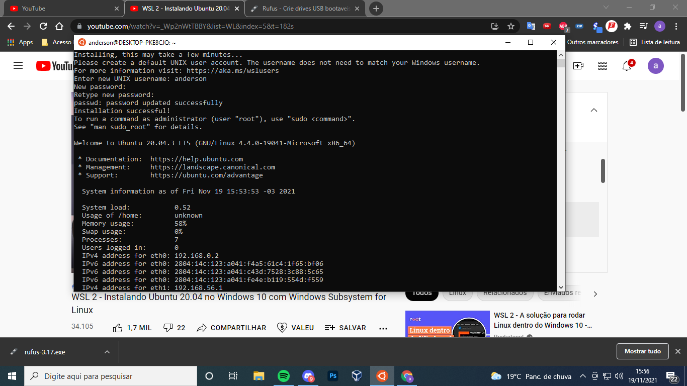
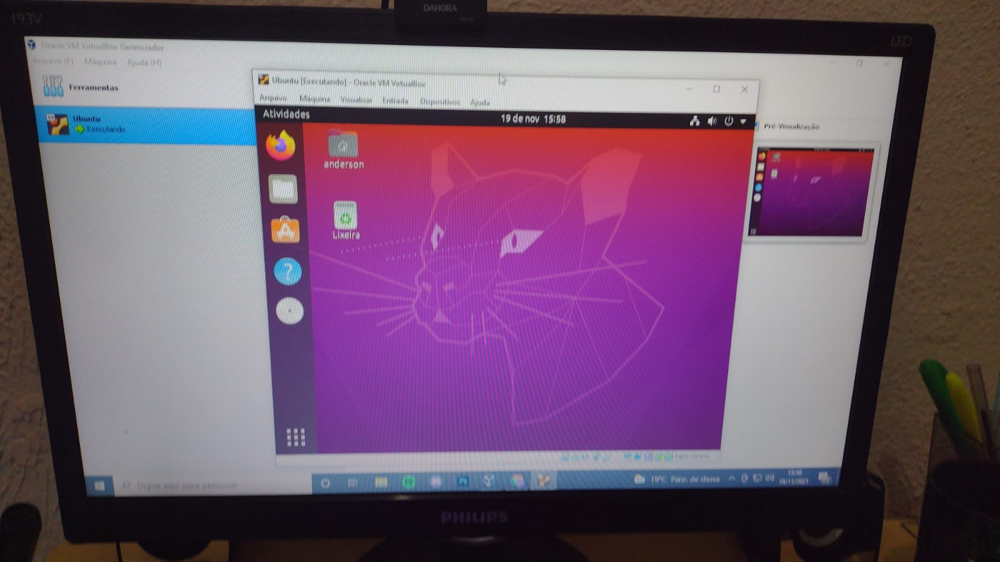

<h4 align="center"> 
  ♻️ Concluído 🚀
</h4>

## ❓ Enunciado
---

Tendo como base as referências desta parte 2 do módulo de Linux, demonstre a instalação do Linux utilizando pelo menos uma das três maneiras de instalação de Linux em seu computador.

Observação: se possível, demonstre a realização das 3 instalações.

## 📝 Resolução
---

### Instalar pelo pendrive

### Instalar como subsistema do windows

## Instalar pelo VirtualBox

