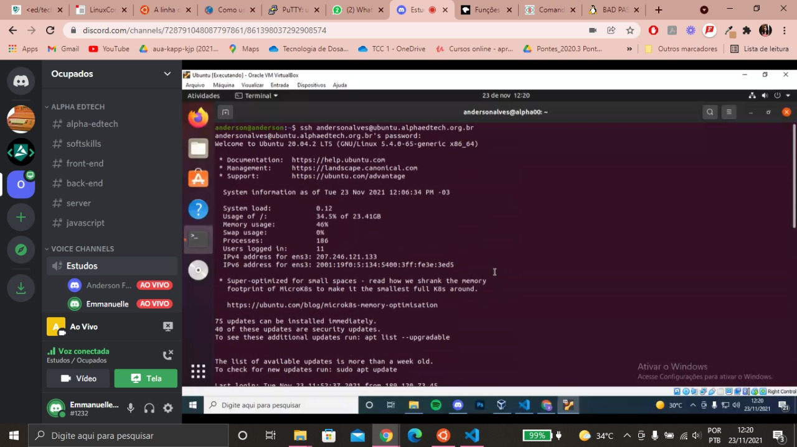
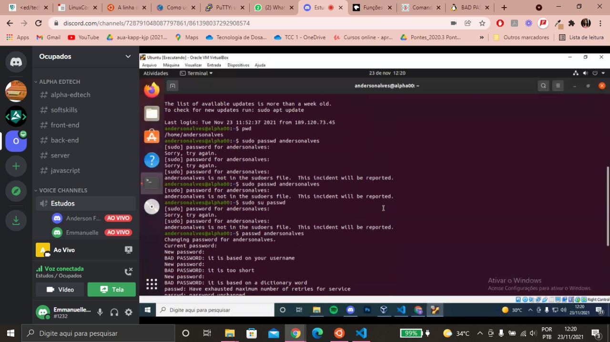
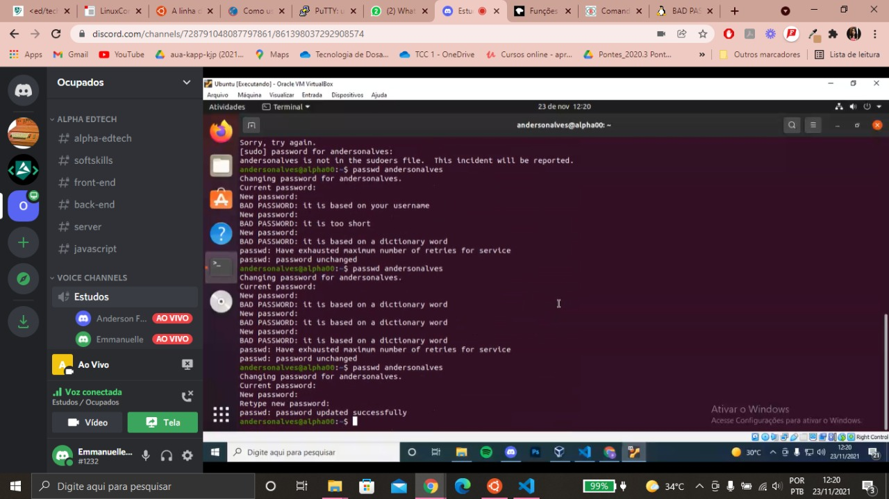
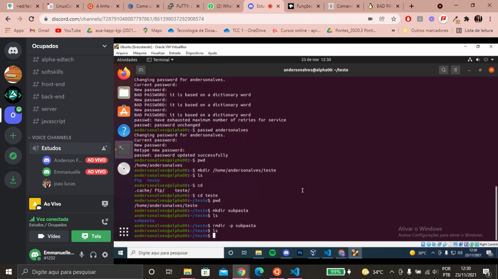

<h4 align="center"> 
  ♻️ Concluído 🚀
</h4>

## ❓ Enunciado
---

Instale um cliente SSH e conecte ao servidor para testes da Alpha EdTech e:

a. Identifique a pasta atual que, ao entrar você foi redirecionado utilizando o comando ‘pwd’; 

b. Altere a sua senha; 

c. Crie uma pasta chamada ‘teste’ dentro da sua pasta; 

d. Vá até a pasta criada utilizando o comando ‘cd’; 

e. Crie uma pasta chamada ‘subpasta’ dentro da pasta teste; 

f. Apague a pasta ‘subpasta’ criada utilizando o comando ‘rmdir’; 

g. Tire um ‘print’ de toda a sequência realizada e envie sua atividade. 

## 📝 Resolução
---

