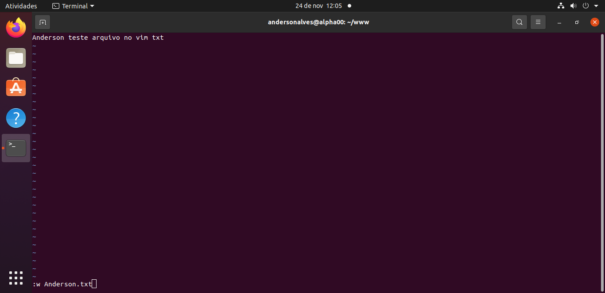
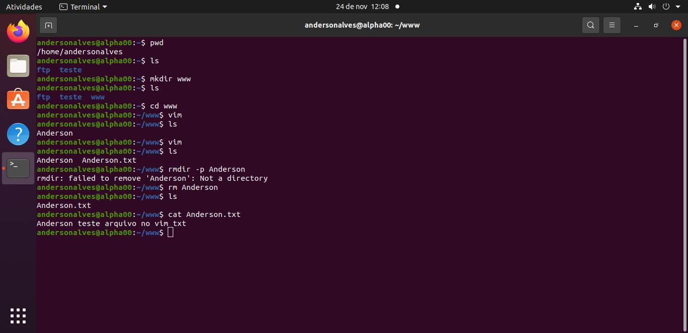
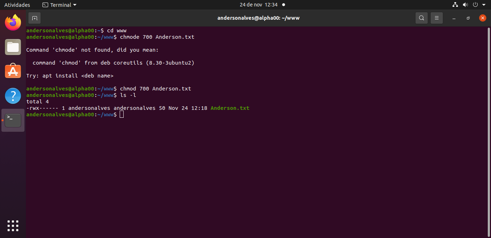

<h4 align="center"> 
  ♻️ Concluído 🚀
</h4>

## ❓ Enunciado
---

Acesse o servidor ubuntu.alphaedtech.org.br com um cliente SSH utilizando as suas credenciais passadas anteriormente e:

Crie uma pasta chamada ‘www’ dentro da sua pasta;
Dentro desta pasta, crie um arquivo utilizando o Vim;
Mostre o conteúdo do arquivo criado utilizando o comando cat;
Mude sua permissão para que seja apenas possível a sua leitura, escrita e execução pelo seu usuário, sendo proibido para todos os demais usuários e grupos.
Enviar um arquivo zipado com os prints dos passos acima.

## 📝 Resolução
---

