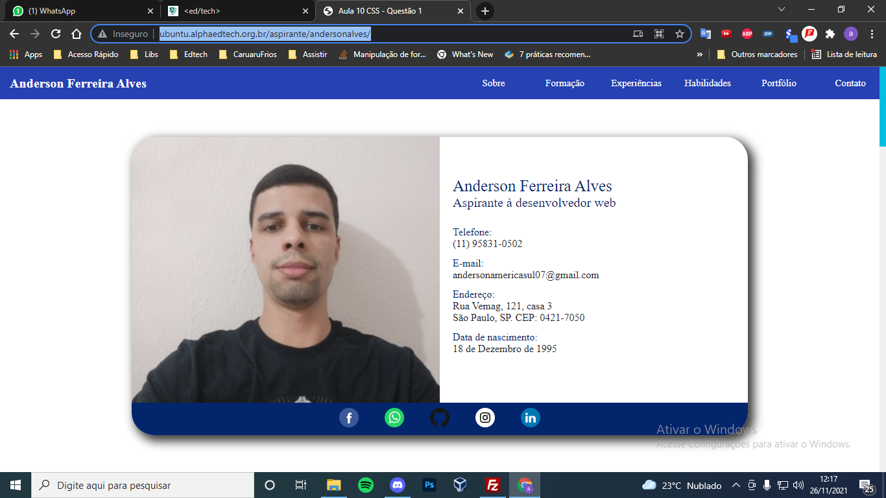
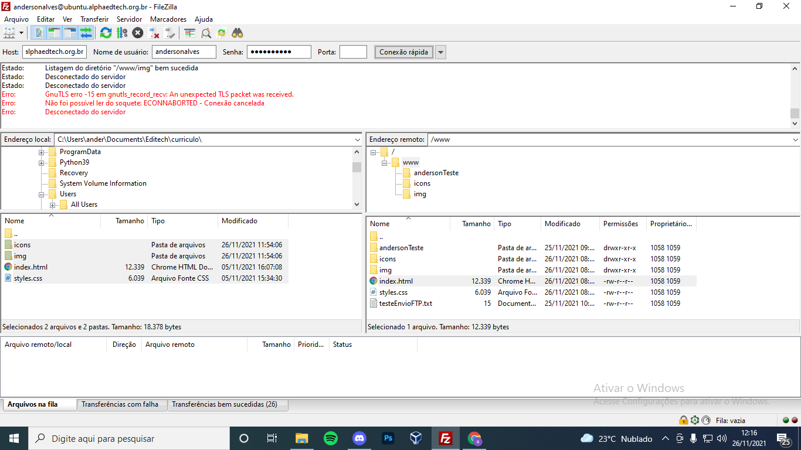

<h4 align="center"> 
  ♻️ Concluído 🚀
</h4>

## ❓ Enunciado
---
Utilizar o Filezilla para conectar no servidor e enviar seu curriculum criado para a pasta ‘www’.

Acessar o endereço ‘http://ubuntu.alphaedtech.org.br/aspirante/<seu usuário>/’ demonstrando que a sua página está no ar. 

Não se esqueça de colocar o nome do arquivo do curriculum como ‘index.html’.

## 📝 Resolução
---

