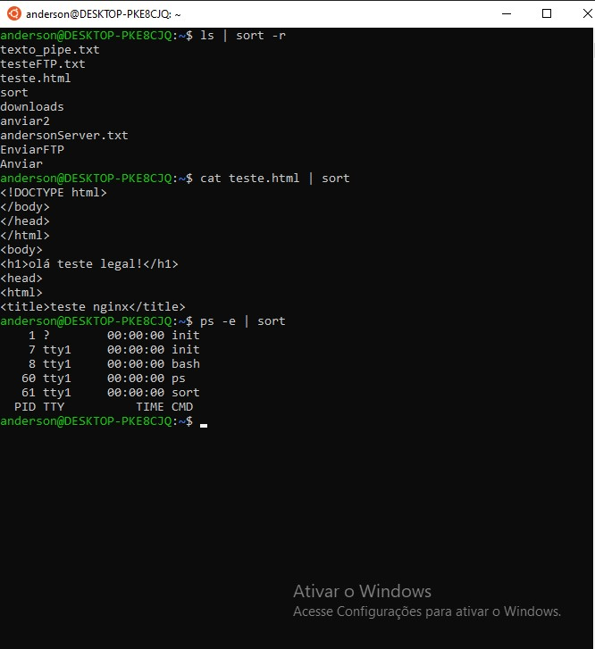

<h4 align="center"> 
  ♻️ Concluído 🚀
</h4>

## ❓ Enunciado
---
Utilize o piping ‘|’ para mostrar o seu uso com os comandos ‘ls’, ‘cat’, ‘sort’ e ‘ps’. 

Envie o print da execução do comando e do resultado.

## 📝 Resolução
---

