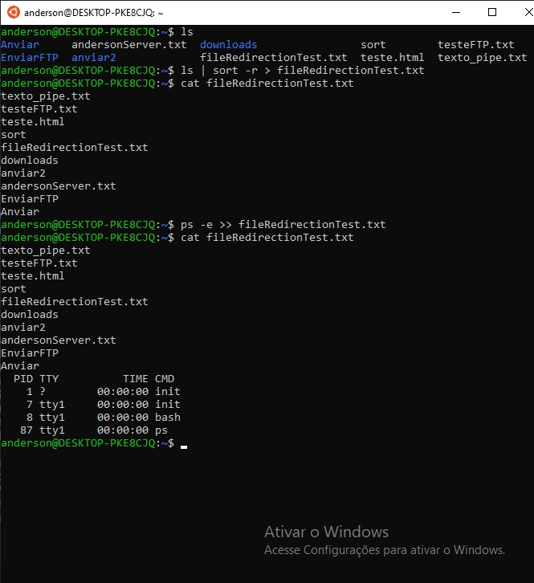

<h4 align="center"> 
  ♻️ Concluído 🚀
</h4>

## ❓ Enunciado
---
Utilize o sistema de ‘file redirection’ para a criação de um arquivo e outro para adicionar dados em um arquivo.

Envie o print da execução do comando e do resultado.

## 📝 Resolução
---

