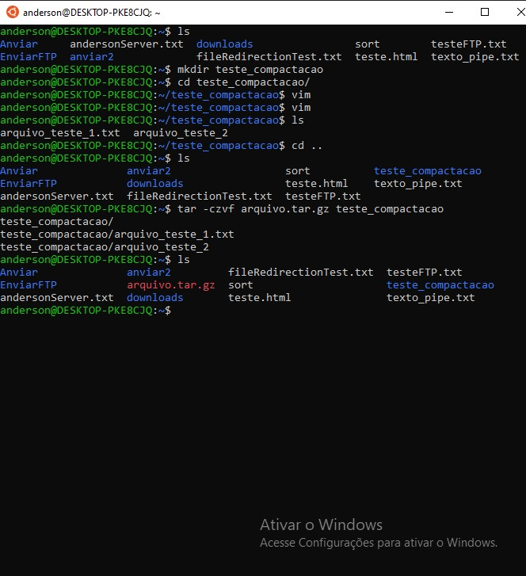

<h4 align="center"> 
  ♻️ Concluído 🚀
</h4>

## ❓ Enunciado
---
Crie uma pasta, adicione arquivos e compacte a pasta para um arquivo do tipo ‘arquivo.tar.gz’.

Envie o print da execução do comando e do resultado.

## 📝 Resolução
---
