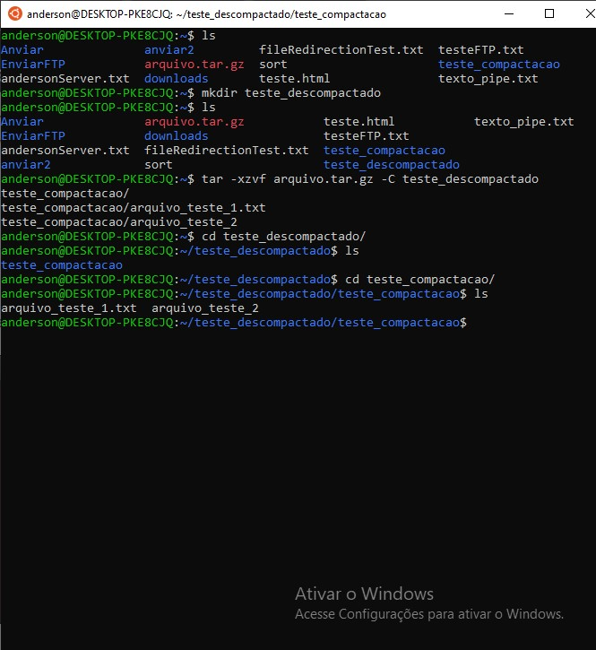

<h4 align="center"> 
  ♻️ Concluído 🚀
</h4>

## ❓ Enunciado
---
Vá até uma outra pasta e descompacte o arquivo criado anteriormente.

Envie o print da execução do comando e do resultado.

## 📝 Resolução
---
