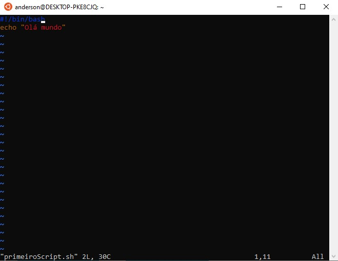
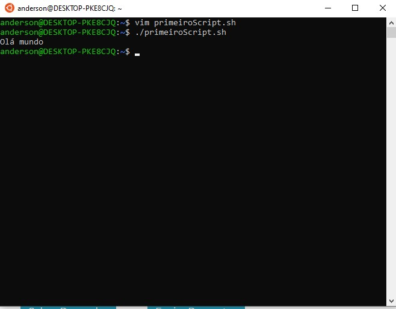
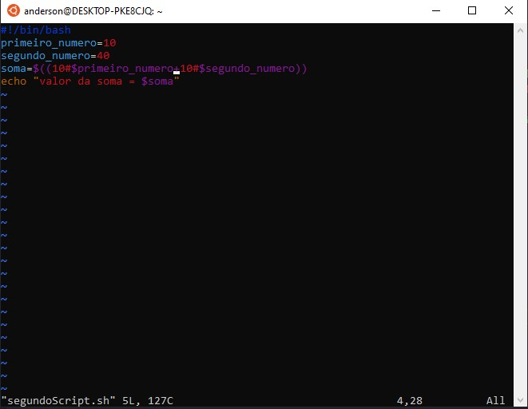
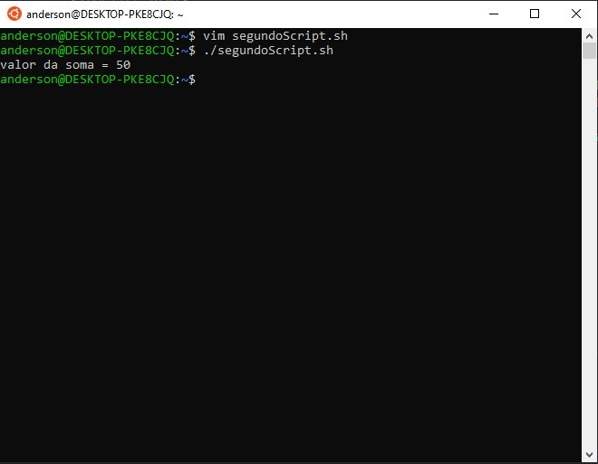
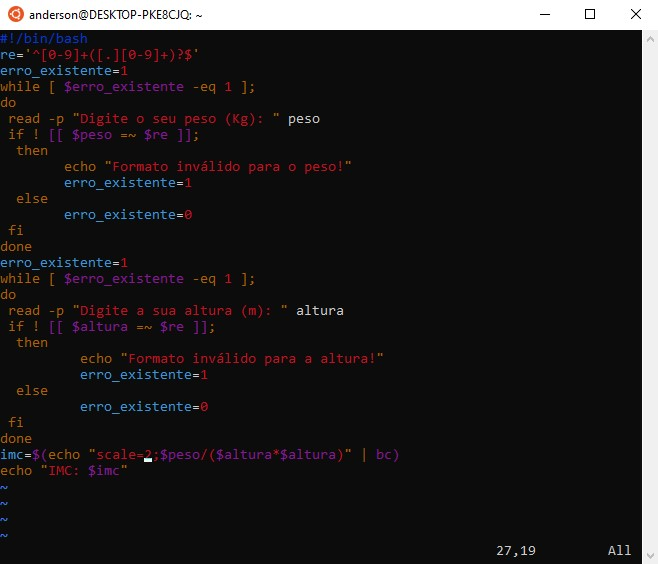
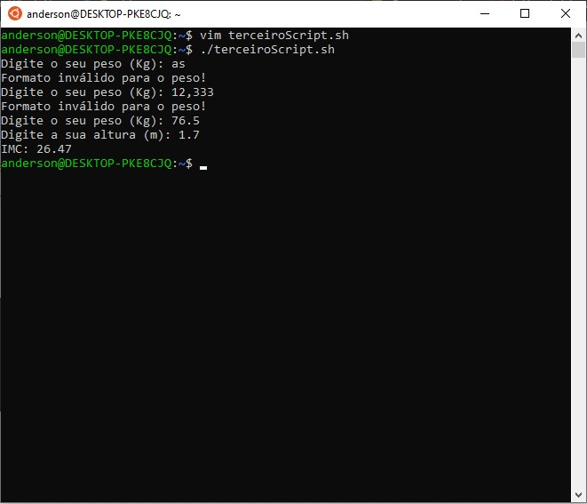

<h4 align="center"> 
  ♻️ Concluído 🚀
</h4>

## ❓ Enunciado
---
Crie scripts com o ‘vim’, atribua a permissão de execução e execute-o para:

a. Mostrar uma mensagem de: “Ola Mundo!”. 
b. Criar duas variáveis com valores e mostrar a soma delas. 
c. Pedir ao usuário o seu PESO e sua ALTURA e mostrar o seu IMC (Índice de Massa Corporal).

## 📝 Resolução
---

