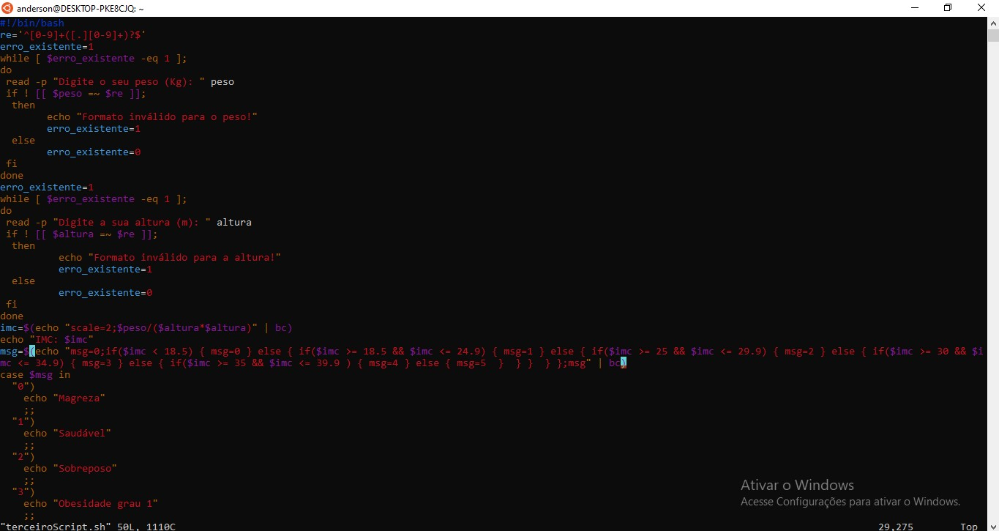
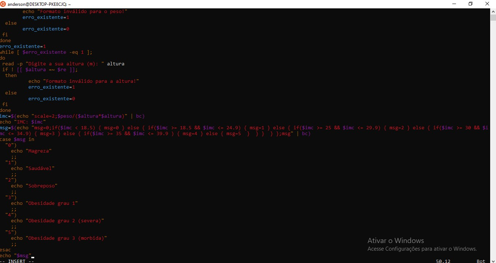
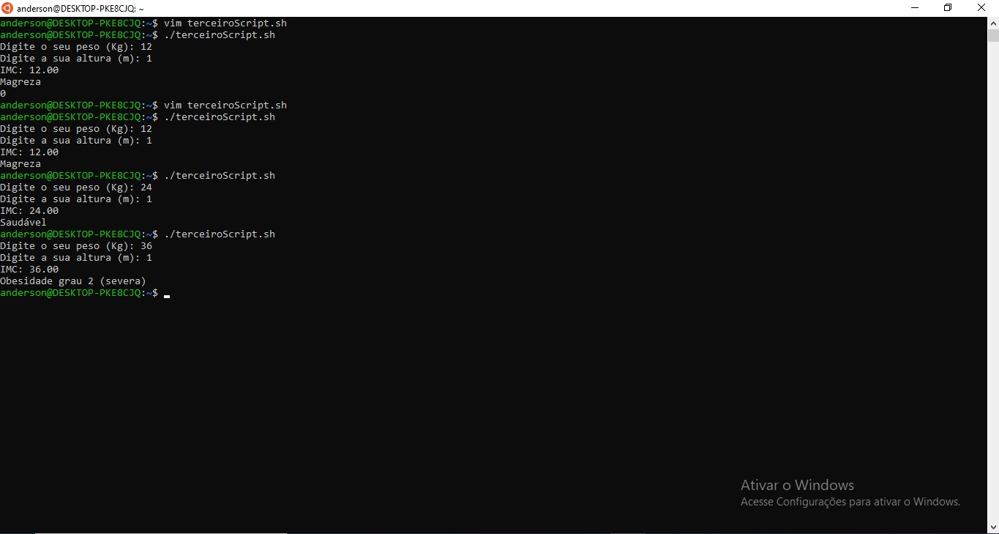
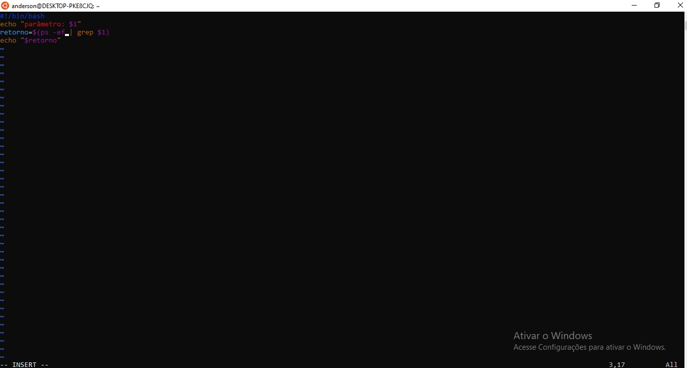
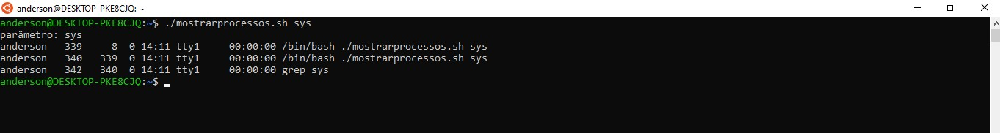

<h4 align="center"> 
  ♻️ Concluído 🚀
</h4>

## ❓ Enunciado
---
Crie scripts com o ‘vim’, atribua a permissão de execução e execute-o para:

a. Criar um programa para cálculo do IMC com a exibição de mensagem para indicar a sua classificação (observar o endereço:  http://www.unimed.coop.br/pct/index.jsp?cd_canal=49146&cd_secao=-1&cd_materia=299005 )

b. Receber um parâmetro na execução do seu script e utilizá-los para mostrar os processos que estejam sendo executados que contenham este parâmetro. Este parâmetro é externo ao script criado e é passado no momento de sua execução, por exemplo: “./mostrarprocessos  ss”

## 📝 Resolução
---

